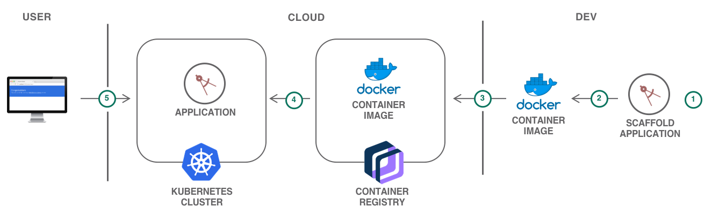

# Getting started with scalable web application on Kubernetes

This lab walks you through how to scaffold a web application, run it locally in a container, and then deploy it to a **Kubernetes** cluster running in the [IBM Cloud Kubernetes Service](https://cloud.ibm.com/containers-kubernetes/catalog/cluster). Additionally, you will learn how to bind a domain, monitor the health of the environment, and scale the application.

**Containers** are a standard way to package apps and all their dependencies so that you can seamlessly move the apps between environments. Unlike virtual machines, containers do not bundle the operating system. Only the app code, run time, system tools, libraries, and settings are packaged inside containers. Containers are more lightweight, portable, and efficient than virtual machines.

For developers looking to kickstart their projects, the IBM Cloud Developer Tools CLI enables rapid application development and deployment by generating template applications that you can run immediately or customize as the starter for your own solutions. In addition to generating starter application code, Docker container image and Cloud Foundry assets, the code generators used by the dev CLI and web console generate files to aid deployment into Kubernetes environments. The templates generate **Helm** charts that describe the application’s initial Kubernetes deployment configuration, and are easily extended to create multi-image or complex deployments as needed.

## Objectives

* Scaffold a starter application.
* Deploy the application to the Kubernetes cluster.
* Bind a domain.
* Monitor the logs and health of the cluster.
* Scale Kubernetes pods.

## Architecture

1. A developer generates a starter application with IBM Cloud Developer Tools.
1. Building the application produces a Docker container image.
1. The image is pushed to a namespace in Kubernetes Service.
1. The application is deployed to a Kubernetes cluster.
1. Users access the application.

## Services used

This tutorial uses the following runtimes and services:
* [IBM Cloud Container Registry](https://cloud.ibm.com/containers-kubernetes/launchRegistryView)
* [IBM Cloud Kubernetes Service](https://cloud.ibm.com/containers-kubernetes/catalog/cluster)
