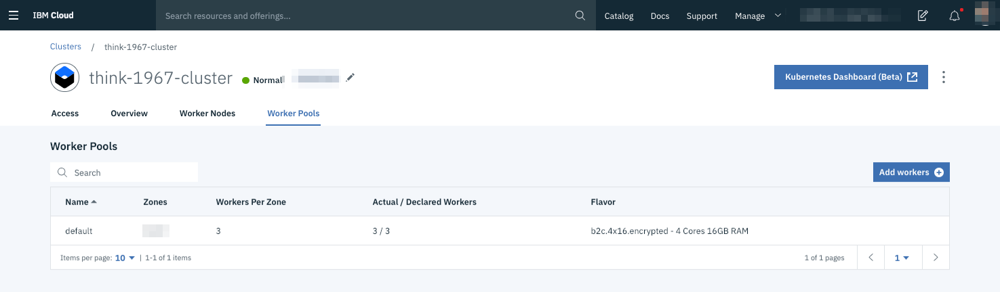

# Worker Nodes and Pools

A cluster is made of worker nodes. The nodes run the applications you deployed to Kubernetes. Worker nodes are attached to worker pools.

A worker pool groups worker nodes with the same configuration, such as the machine type. You can add more worker nodes to your cluster by resizing an existing worker pool or by adding a new worker pool.

To increase application resiliency, it is recommended to use multiple availability zones within a region when configuring worker pools.
