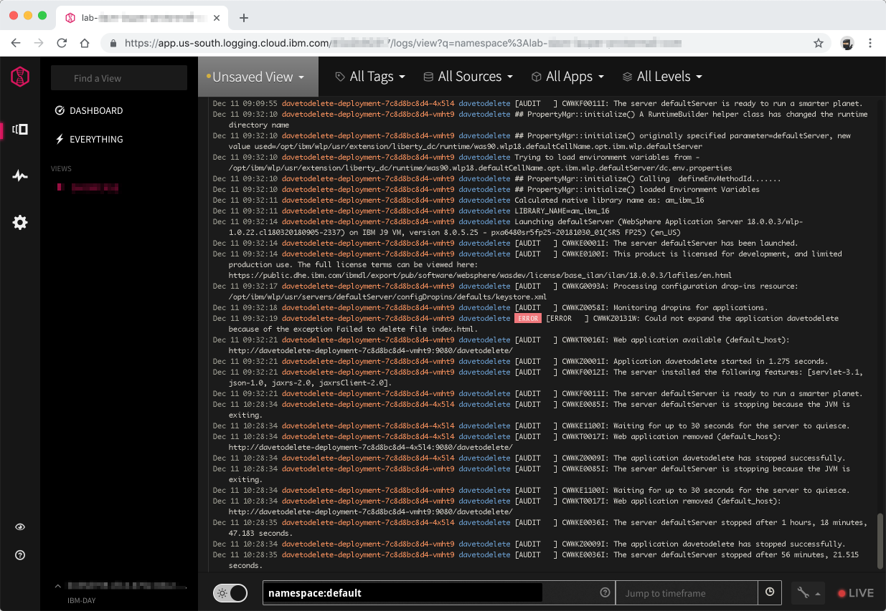

# Logging

## Using the Kubernetes dashboard

1. Go to the [cluster list](https://cloud.ibm.com/containers-kubernetes/clusters).
1. Select your Kubernetes cluster.
1. Use the **Kubernetes Dashboard** button to open the Kubernetes dashboard.
1. Select the Kubernetes namespace where your application is deployed.
1. To review the application logs from the container, select **Pods**, **pod-name** and **Logs**.

## Using IBM Log Analysis with LogDNA

IBM Log Analysis with LogDNA is a third-party service that you can include as part of your IBM Cloud architecture to add log management capabilities. IBM Log Analysis with LogDNA is operated by LogDNA in partnership with IBM.

The service plan that you choose for an IBM Log Analysis with LogDNA instance defines the number of days that data is stored and retained in LogDNA. For example, if you choose the Free plan, data is not stored at all. However, if you choose the 7 day plan, data is stored for 7 days and you have access to it through the LogDNA Web UI.

## Configure your cluster with LogDNA

1. Switch to your personal IBM Cloud account.
1. Create an instance of [IBM Log Analysis with LogDNA](https://cloud.ibm.com/observe/logging/create) from the catalog:
   1. Set the **Service name** to **YOUR_IBM_ID-logdna**.
   1. Select the location where your cluster is created. If the location is not in the list, pick Dallas (us-south).
   1. Use the default resource group.
   1. Click **Create**.
1. In the [**Observability** category, under Logging](https://cloud.ibm.com/observe/logging), locate the service instance you created.
1. Click **Edit log sources**:
   1. Select **Kubernetes** as a source
   1. Run the listed commands against your Kubernetes cluster.

## View logs in the LogDNA dashboard

1. Click **View LogDNA** to open the LogDNA console
1. Use `namespace:<namespace name>` to view only the logs of the applications deployed to the specified namespace, such as `namespace:default`
1. As you go through the next steps, keep an eye on the LogDNA console for new log statements coming from your apps deployed in this namespace.


Find more about IBM Log Analysis with LogDNA in the [IBM Cloud documentation](https://cloud.ibm.com/docs/services/Log-Analysis-with-LogDNA/index.html#getting-started).

