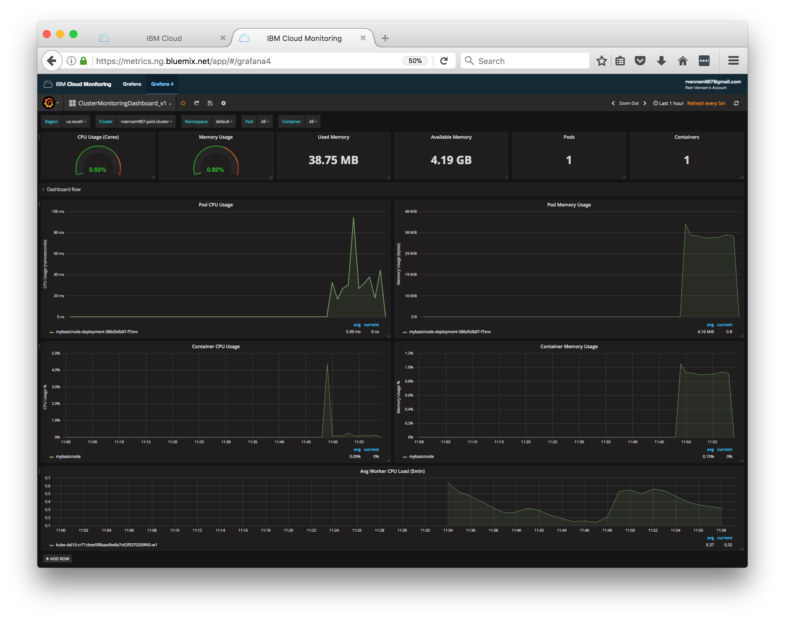
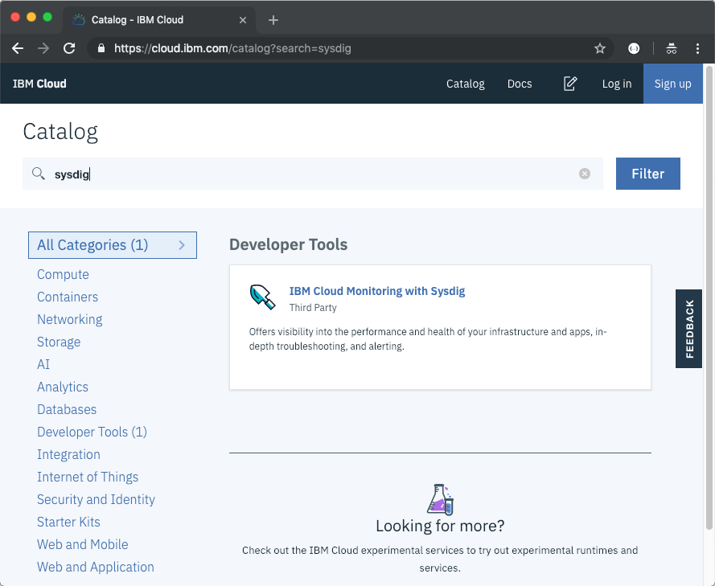
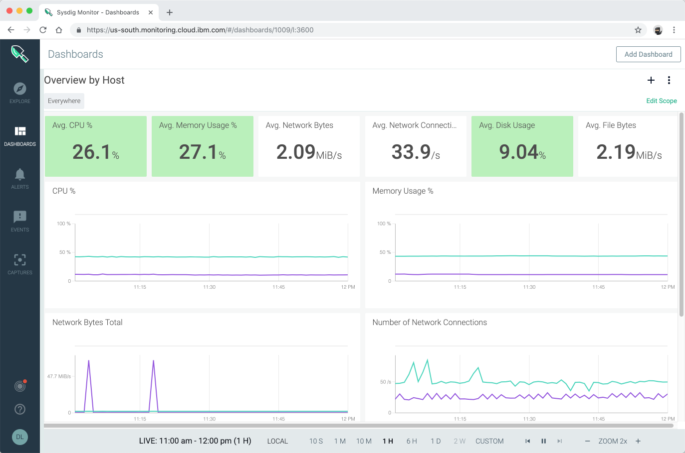

# Monitoring

<!-- ## Using Grafana

Metrics for standard clusters are located in the IBM Cloud account that was logged in to when the Kubernetes cluster was created. If you specified an IBM Cloud space when you created the cluster, then metrics are located in that space. Container metrics are collected automatically for all containers that are deployed in a cluster. These metrics are sent and are made available through Grafana.

1. To view **metrics**, navigate to [clusters](https://cloud.ibm.com/containers-kubernetes/clusters) and select the appropriate **location** to see your cluster.
2. Next to **Metrics**, click **View**. This should launch Grafana in a new tab.
3. In the top right corner, click on your username and choose **Domain**: **account** and select your **Account**.
4. Click on **Home** and select the **ClusterMonitoringDashboard_V5** dashboard that has been pre-defined.
5. Select the region value where your cluster was created next to **Region** and select your cluster name next to **Cluster**.
   
6. In a different window, visit your application URL and refresh the page several times to generate some load.
7. Refresh your Grafana dashboard to see the updated metrics.
    -->

## Using IBM Cloud Monitoring with Sysdig

Sysdig monitor is a third-party cloud-native container-intelligence management system. You can use this to gain operational visibility for your applications, services, and platform. Sysdig offers administrators, DevOps teams and developers advanced features to monitor and troubleshoot, define alerts, and design custom views.



## Create a Sysdig service instance

1. Switch to your personal IBM Cloud account.
1. Create an instance of [IBM Cloud Monitoring with Sysdig](https://cloud.ibm.com/observe/monitoring/create) from the catalog:
   1. Set the **Service name** to **YOUR_IBM_ID-sysdig**.
   1. Select the location where your cluster is created. If the location is not in the list, pick Dallas (us-south).
   1. Use the default resource group.
   1. Click **Create**.
1. In the [**Observability** category, under Monitoring](https://cloud.ibm.com/observe/monitoring), locate the service instance you created.
1. Click **View access keys** and copy your access key as it will be needed in later steps.

<!-- 1. Select **Kubernetes** as a source and at the bootom of that page follow the instructions to Install Sysdig Agent to your cluster or follow the steps below:

1. ***TO DELETE:*** Automated steps included in the instructions are bash only and they do not work in Windows Command line. 
```sh
curl -sL https://ibm.biz/install-sysdig-k8s-agent | bash -s -- -a b66e3139-b40a-46bc-af17-615dceedfdd0 -c ingest.us-south.monitoring.cloud.ibm.com -ac 'sysdig_capture_enabled: false'
``` -->

## Configure your cluster with Sysdig

1. Create a service account called sysdig-agent to monitor the kubernetes cluster:

   ```sh
   kubectl create serviceaccount sysdig-agent
   ```

1. Add a secret to your Kubernetes cluster:

   ```sh
   kubectl create secret generic sysdig-agent --from-literal=access-key=SYSDIG_ACCESS_KEY
   ```

   The SYSDIG_ACCESS_KEY is the access key copied earlier.

1. Download the [sysdig-agent-clusterrole.yaml](https://raw.githubusercontent.com/draios/sysdig-cloud-scripts/master/agent_deploy/kubernetes/sysdig-agent-clusterrole.yaml).

1. Add the Sysdig agent cluster role:
   ```sh
   kubectl apply -f sysdig-agent-clusterrole.yaml
   ```

1. Add a cluster role binding:
   ```sh
   kubectl create clusterrolebinding sysdig-agent --clusterrole=sysdig-agent --serviceaccount=default:sysdig-agent
   ```

1. Download the [sysdig-agent-configmap.yaml](https://raw.githubusercontent.com/draios/sysdig-cloud-scripts/master/agent_deploy/kubernetes/sysdig-agent-configmap.yaml).

1. Edit the `sysdig-agent-configmap.yaml` and add required parameters for configuring the agent to work in the IBM Cloud:
   - ***k8s_cluster_name***: This parameter specifies the cluster name as a metric label. You can use the label kubernetes.cluster.name to navigate the Kubernetes dashboards by cluster name and filter out metrics associated with the cluster.
   - ***collector***: This parameter specifies the ingestion URL for the region where the monitoring instance is available.
   - ***collector_port***: This parameter indicates the port on which the collector is listening on. It's value must be 6443.
   - ***ssl***: This parameter must be set to true.
   - ***ssl_verfiy_certificate***: This parameter must be set to true.
   - ***new_k8s***: This parameter must be set to true to capture kube state metrics.
   - ***sysdig_capture_enabled***: This parameter enables or disables the Sysdig capture feature. By default is set to true. 

   An example yaml file looks like this:

   ```sh
    apiVersion: v1
    kind: ConfigMap
    metadata:
    name: sysdig-agent
    data:
    dragent.yaml: |
        ### Agent tags
        tags: linux:ubuntu,dept:dev,local:nyc

        #### Sysdig Software related config ####

        # Sysdig collector address
        collector: us-south.monitoring.cloud.ibm.com

        # Collector TCP port
        collector_port: 6443

        # Whether collector accepts ssl
        ssl: true

        # collector certificate validation
        ssl_verify_certificate: true

        #######################################
        new_k8s: true
        k8s_cluster_name: lab-1

        sysdig_capture_enabled: false
   ```

1. Apply the config map to the cluster:
   ```sh
   kubectl apply -f sysdig-agent-configmap.yaml
   ```
1. Download the [sysdig-agent-daemonset-v2.yaml](https://raw.githubusercontent.com/draios/sysdig-cloud-scripts/master/agent_deploy/kubernetes/sysdig-agent-daemonset-v2.yaml).
1. Apply the daemonset to deploy the Sysdig agent to the cluster. Run the following command:
   ```sh
   kubectl apply -f sysdig-agent-daemonset-v2.yaml
   ```

## View metrics with Sysdig

1. Click **View Sysdig** to open the Sysdig console
1. In the Sysdig _Welcome_ wizard
   1. Select **Kubernetes** as the installation method.
   1. It should show one or more agents already connected.
   1. Select **GO TO NEXT STEP**.
   1. And finally **LET'S GET STARTED**
1. Navigate the Sysdig console to get metrics on your Kubernetes cluster, nodes, deployments, pods, containers.
   1. Under **Explore**, select **Containerized Apps** to view raw metrics for all workloads running on the cluster.
   1. Under **Dashboard**, select **My Shared Dashboards / HTTP Overview** to get a global view of the cluster HTTP load.
   1. Under **Dashboard**, select **My Shared Dashboards / Overview by Host** to understand how nodes are currently performing.

   
   If Kubernetes-specific views do not show data, wait till your cluster starts sending metrics to Sysdig and refresh the Sysdig monitor console.
   




Find more about IBM Cloud Monitoring with Sysdig in the [IBM Cloud documentation](https://cloud.ibm.com/docs/services/Monitoring-with-Sysdig/index.html#getting-started).

