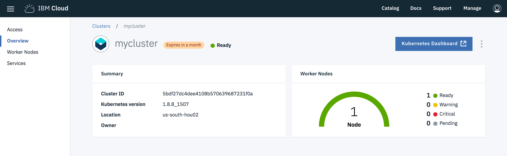

# Kubernetes Dashboard

1. To check the health of your application, navigate to [clusters](https://cloud.ibm.com/containers-kubernetes/clusters) to see a list of clusters and click on the cluster you were assigned to.
2. Click **Kubernetes Dashboard** to launch the dashboard in a new tab.
   
3. Select **Nodes** on the left pane, click the **Name** of the nodes and see the **Allocation Resources** to see the health of your nodes.
   
